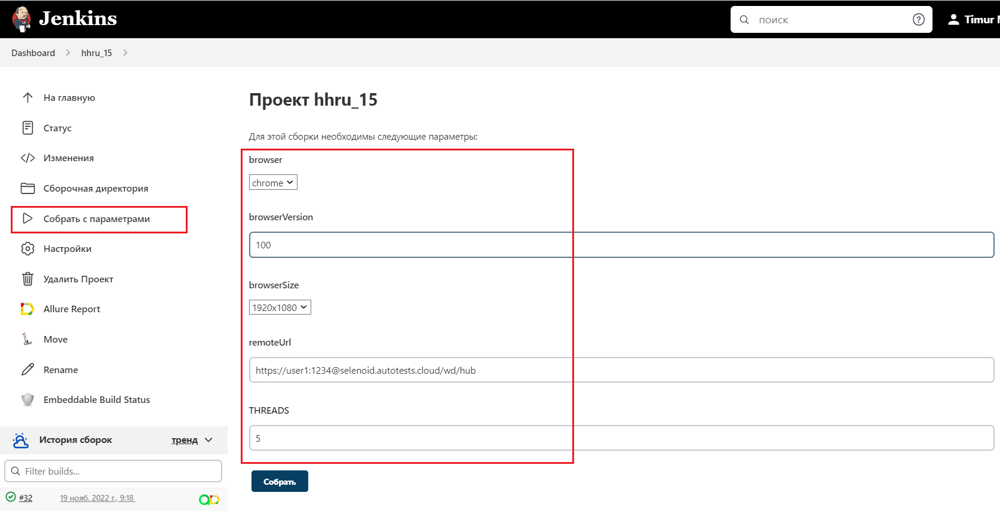
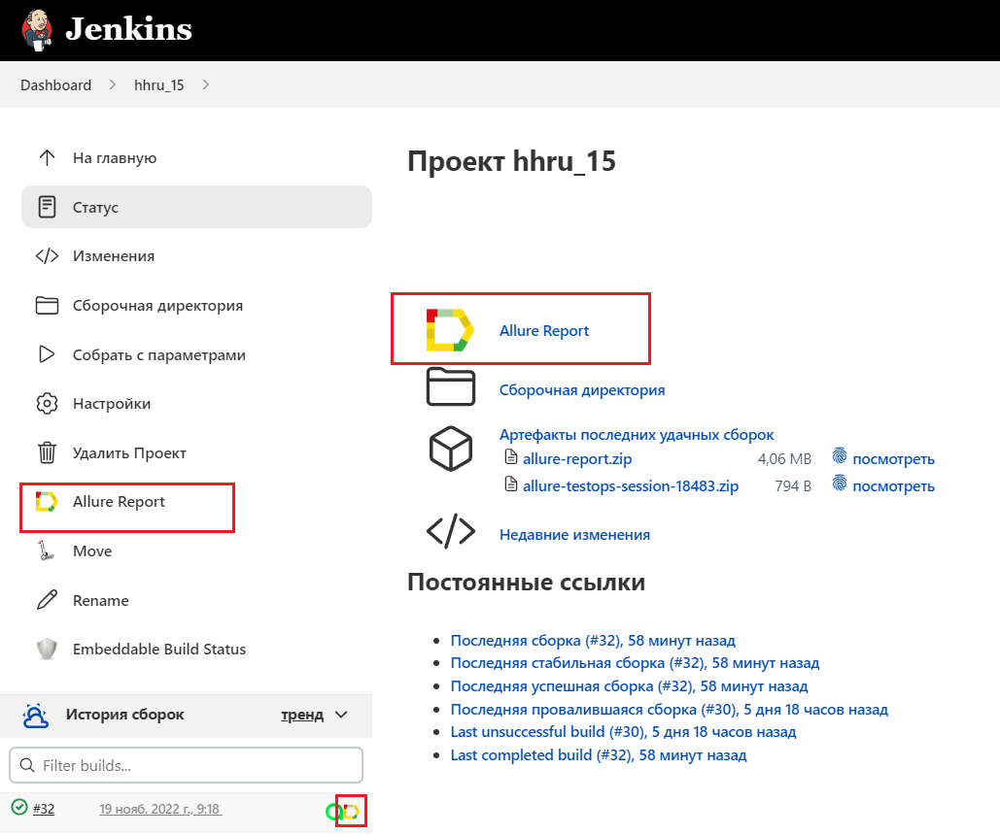
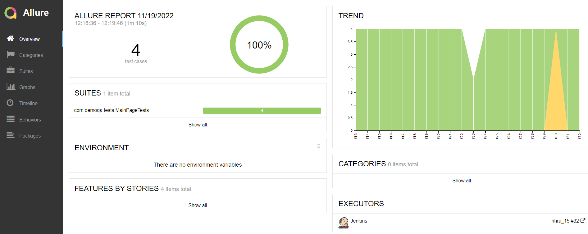
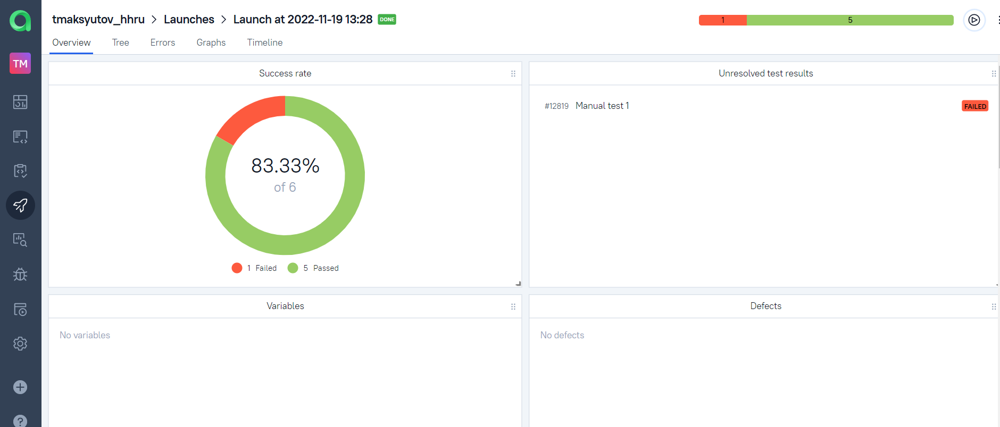
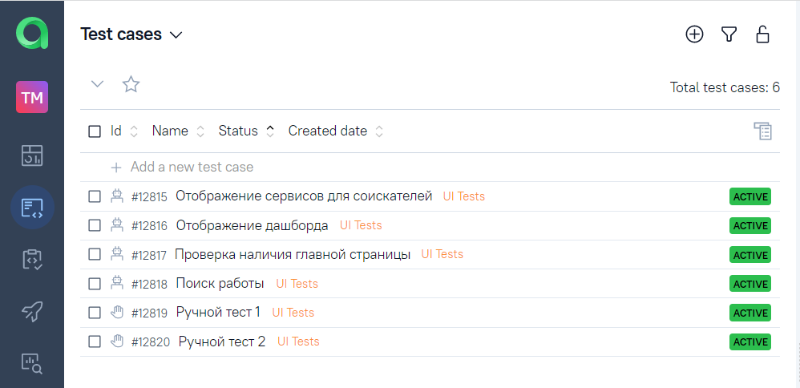
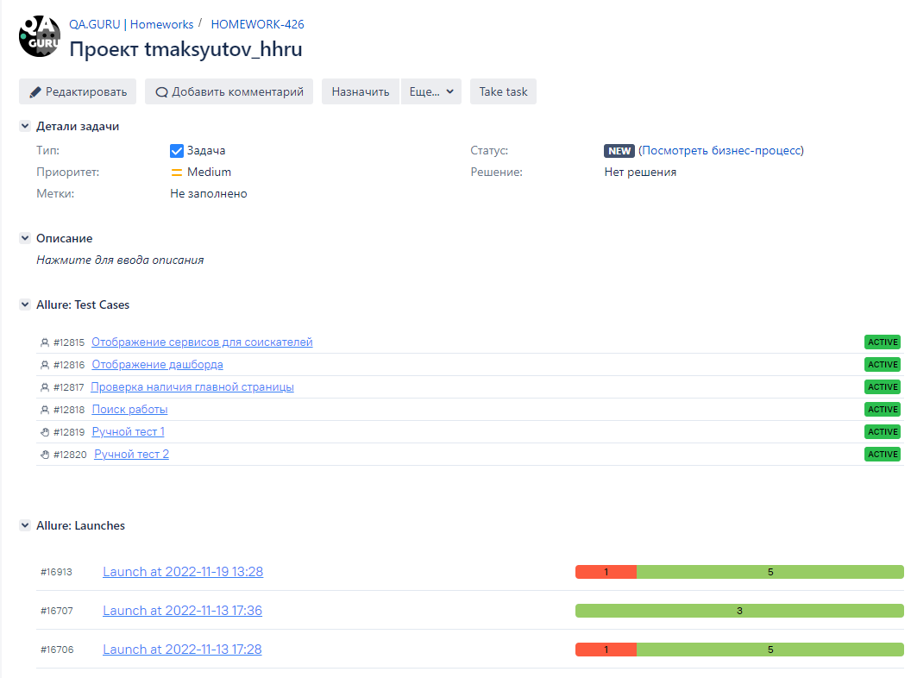
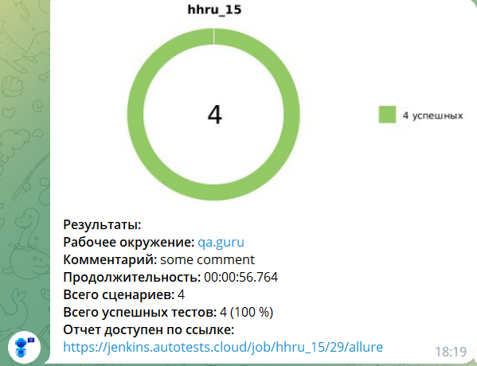

## Проект по автоматизации тестирования сайта hh.ru

##	Содержание

- [Технологии и инструменты](#-Технологии-и-инструменты)
- [Реализованы проверки](#bookmark_tabs-реализованы-проверки)
- [Запуск тестов из терминала](#computer-Запуск-тестов-из-терминала)
- [Запуск тестов в Jenkins](#jenkins-Запуск-тестов-в-Jenkins)
- [Отчет о результатах тестирования в Allure Report](#allure_report-Отчет-о-результатах-тестирования-в-Allure-report)
- [Интеграция с Allure TestOps](#-Интеграция-с-allure-testops)
- [Интеграция с Jira](#jira-Интеграция-с-jira)
- [Уведомления в Telegram с использованием бота](#telegram-Уведомления-в-telegram-с-использованием-бота)
- [Пример запуска теста в Selenoid](#selenoid-Пример-запуска-теста-в-selenoid)


## Технологии и инструменты

<p  align="center">

<code></code>
<code></code>
<code></code>
<code></code>
<code></code>
<code></code>
<code></code>
<code></code>
<code></code>
<code></code>
<code></code>
<code></code>
</p>


## :bookmark_tabs: Реализованные проверки:

- Проверка результатов поиска работы 
- Проверка отображаения блока сервисов для соискателей 
- Проверка отображения дашборда с вакансиями
- Проверка отображения главной страницы 

## :computer: Запуск тестов из терминала

### Локальный запуск тестов

```bash
gradle clean test
```

### Удаленный запуск тестов

```bash
gradle clean test
-Dbrowser=${browser}
-DbrowserVersion=${browserVersion}
-DbrowserSize=${browserSize}
-DremoteUrl=${remoteUrl}
-Dthreads=${THREADS}
```

## Параметры сборки

 <code>browser</code> – браузер, в котором будут выполняться тесты (_по умолчанию - <code>chrome</code>_).

 <code>browserVersion</code> – версия браузера (_по умолчанию - <code>100</code>_).

 <code>browserSize</code> – размер окна браузера, в котором будут выполняться тесты (_по умолчанию - <code>1920x1080</code>_).

 <code>remoteUrl</code> – логин, пароль и адрес удаленного сервера Selenoid (_по умолчанию указаны в сборке Jenkins_).

 <code>THREADS</code> - параллельный запуск тестов (_по умолчанию - 5_).

## :jenkins: Запуск тестов в [Jenkins](https://jenkins.autotests.cloud/job/hhru_15/)

Для запуска сборки необходимо указать значения параметров и нажать кнопку <code><strong>*Собрать*</strong></code>.

<p align="center">
  
</p>

После выполнения сборки, в блоке <code><strong>*История сборок*</strong></code> напротив номера сборки появится
значок *Allure Report*, кликнув по которому, откроется страница с сформированным html-отчетом.

<p align="center">
  
</p>


## :allure_report: Отчет о результатах тестирования в [Allure Report](https://jenkins.autotests.cloud/job/hhru_15/32/allure/)

<p align="center">
  
</p>

## :allure_test_ops: Интеграция с [Allure TestOps](https://allure.autotests.cloud/launch/16913)

## Основной дашборд

<p align="center">
  
</p>
 
## Тест-кейсы 

<p align="center">
  
</p>

## :jira: Интеграция с [Jira](https://jira.autotests.cloud/browse/HOMEWORK-426)

<p align="center">
  
</p>

## :telegram: Уведомления в Telegram с использованием бота
После завершения сборки специальный бот, созданный в <code>Telegram</code>, автоматически обрабатывает и отправляет сообщение с отчетом о прогоне тестов.

<p align="center">

</p>

## :selenoid: Пример запуска теста в Selenoid

К каждому тесту в отчете прилагается видео.

<p align="center">
  
</p>